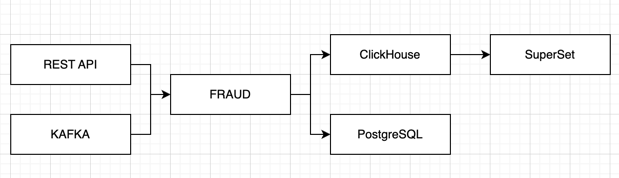
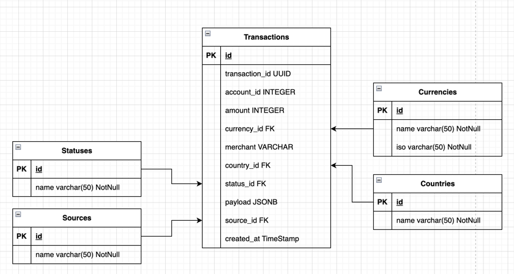
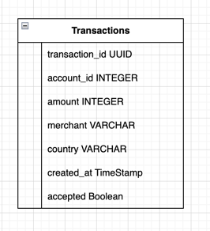
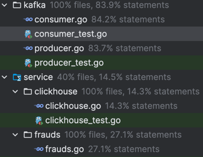
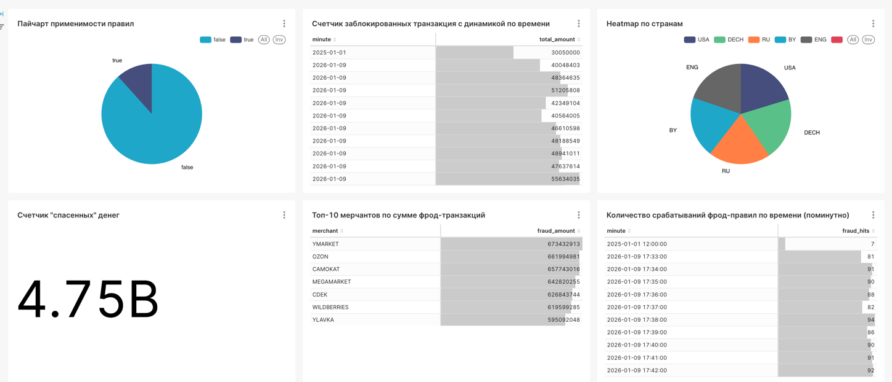

# Антифрод в банковских транзакциях

## Введение

Антифрод-система — это сервис, который получает банковские транзакции,
анализирует их и блокирует их при подозрении в мошенничестве.
Проверка на фрод производится по неким правилам, задаваемых и кастомизируемых в системе в любой момент времени.


## Стек
- Go (Echo, GORM)
- PostgreSQL
- ClickHouse
- Kafka
- Redis
- Apache Superset
- Prometheus
- Docker / Docker Compose


## Запуск

В корне проекта написать: 
```bash
make start_docker
```
Докер должен поднять все. Далее необходимо зайти в 
```bash
 cd internal/database/migrations/clickhouse
```
И скопировать оттуда sql для создания таблицы в ClickHouse. Далее зайти в ClickHouse и вставить это в default БД


В корне проекта написать для запуска producer:
```bash
make start_producer
```
Можно увеличить кол-во создаваемых строк в файле /cmd/kafka/producer.go: 
```
	15: go producer.Start(ctx, 100) // Увеличить со 100 -> inf
```

В корне проекта написать для запуска consumer:
```bash
make start_consumer
```


### Архитектура приложения

Система выдерживает нагрузку под 200 000 сообщений от Kafka. (Можно даже и больше)



### Схемы баз данных



Схема базы данных ClickHouse:


### Описание API

Описание API можно найти в файле: docs/openapi.yaml (Кмк, Golang умеет открывать такие файлы)

## Тестирование

[Коллекция Postman](https://www.postman.com/workspace/My-Workspace~aafcc9ed-558f-406b-8edf-511356d3098d/collection/31106528-cac51f56-f052-46d0-b984-e55908d4c7c2?action=share&creator=31106528)




## Результаты
В качестве результата получилась дашборда по аналитике, данные по которым собираются из трех источников:


Главная задача - создать работающий прототип приложения, была выполнена.

